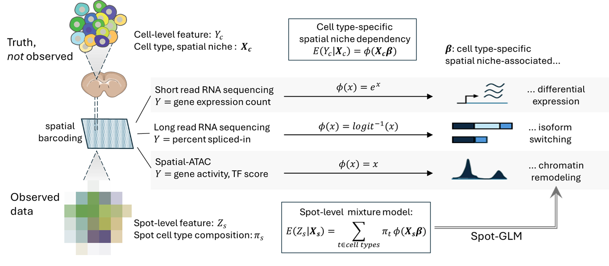

# SpotGLM
SpotGLM is an R package for performing cell type-specific differential analysis
in spatial omics data. It adapts to different data modalities, such as 
gene expression, chromatin accessibility, or isoform usage, and identifies
cell type specific changes associated with local tissue context.
SpotGLM accounts for the mixed-cell composition inherent to spatial barcoding technologies.

[Please see website for full tutorials.](https://kaishumason.github.io/SpotGLM/)

For improved *speed and scalability*, SpotGLM can be paired with the [SPARROW]{} package, 
which selects a power-preserving subset of spatial spots for efficient downstream analysis 
without sacrificing power.

