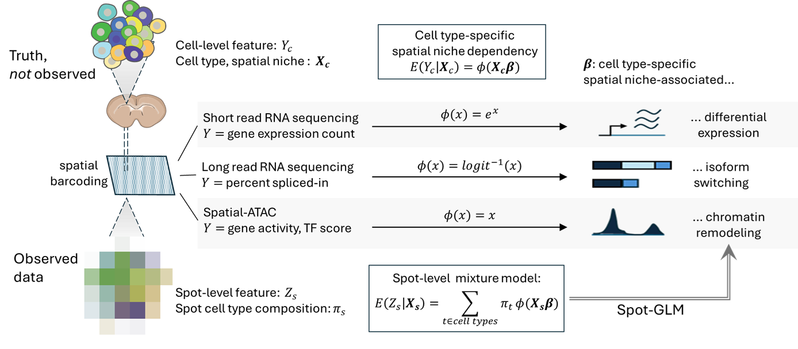

# SpotGLM
SpotGLM is an R package for performing cell type-specific differential analysis in spatial omics data. It adapts to different data modalities, such as gene expression, chromatin accessibility, or isoform usage, and identifies cell type specific changes associated with local tissue context. SpotGLM accounts for the mixed-cell composition inherent to spatial barcoding technologies.

For improved speed and scalability, SpotGLM can be paired with the SPARROW package, which selects a power-preserving subset of spatial spots for efficient downstream analysis without sacrificing power.



## Installation

To install SpotGLM from GitHub:

```r
install.packages("devtools")
devtools::install_github("kaishumason/SpotGLM") # install
```

## Getting Started

Please follow these tutorials to get started on your data:

[Introduction to SpotGLM](articles/Intro_to_SpotGLM.html)

[Using SpotGLM with SPARROW on Visium HD](articles/Vignette_VisiumHD_Mouse_Kidney_analysis.html)

[Another example of Visium HD Analysis](articles/Visium_analysis.html)

[SpotGLM for isoform switching analysis on spatial long read data](articles/Spatial_Long_Read_analysis.html)

[SpotGLM for spatial ATAC analysis](articles/Spatial_ATAC_analysis.html)
