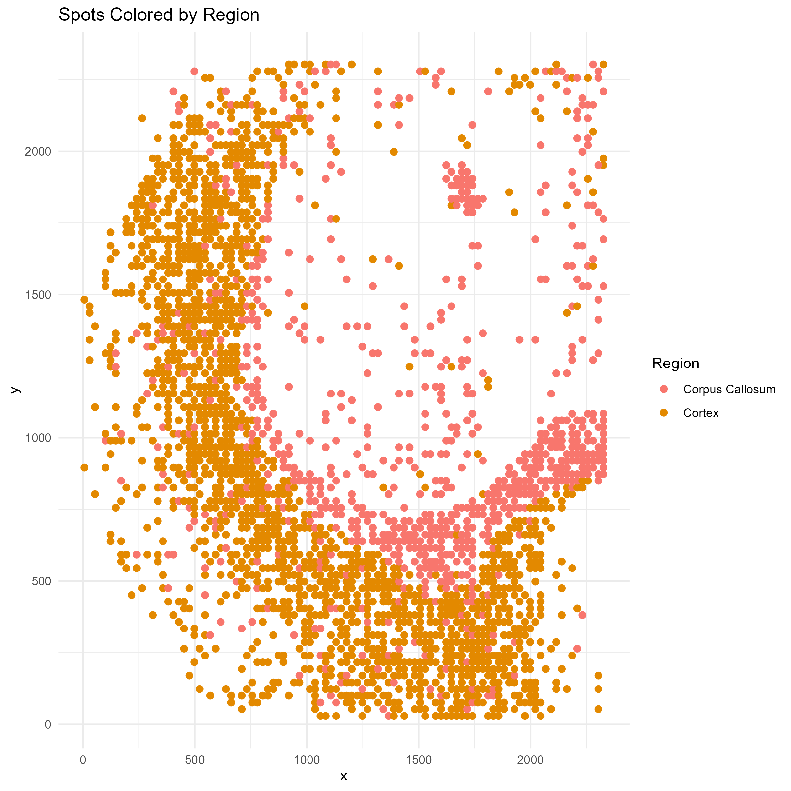
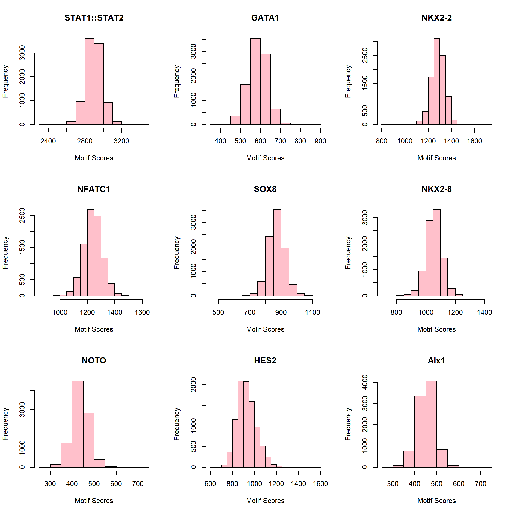
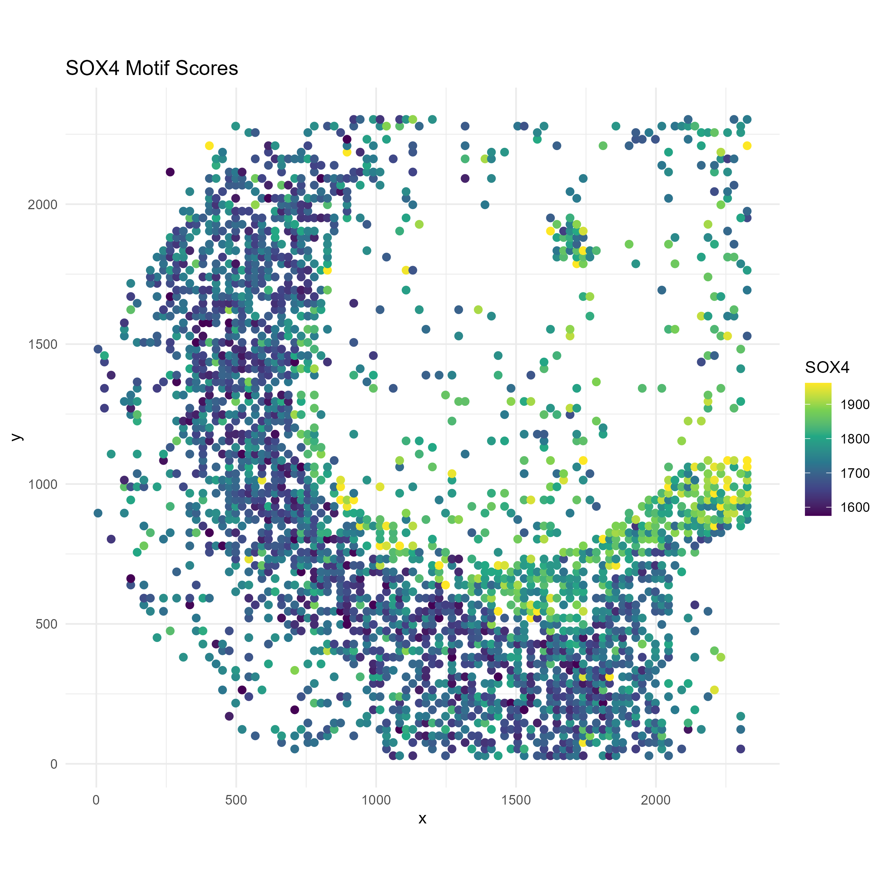
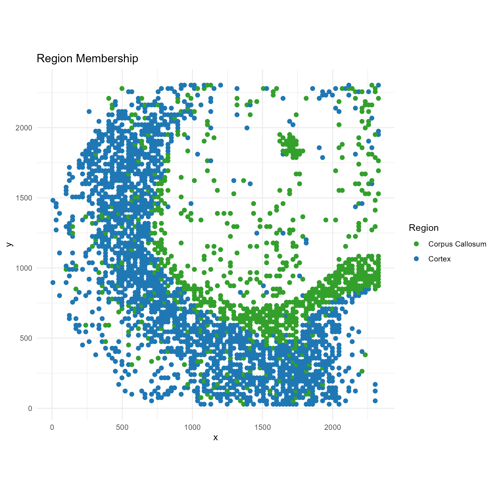
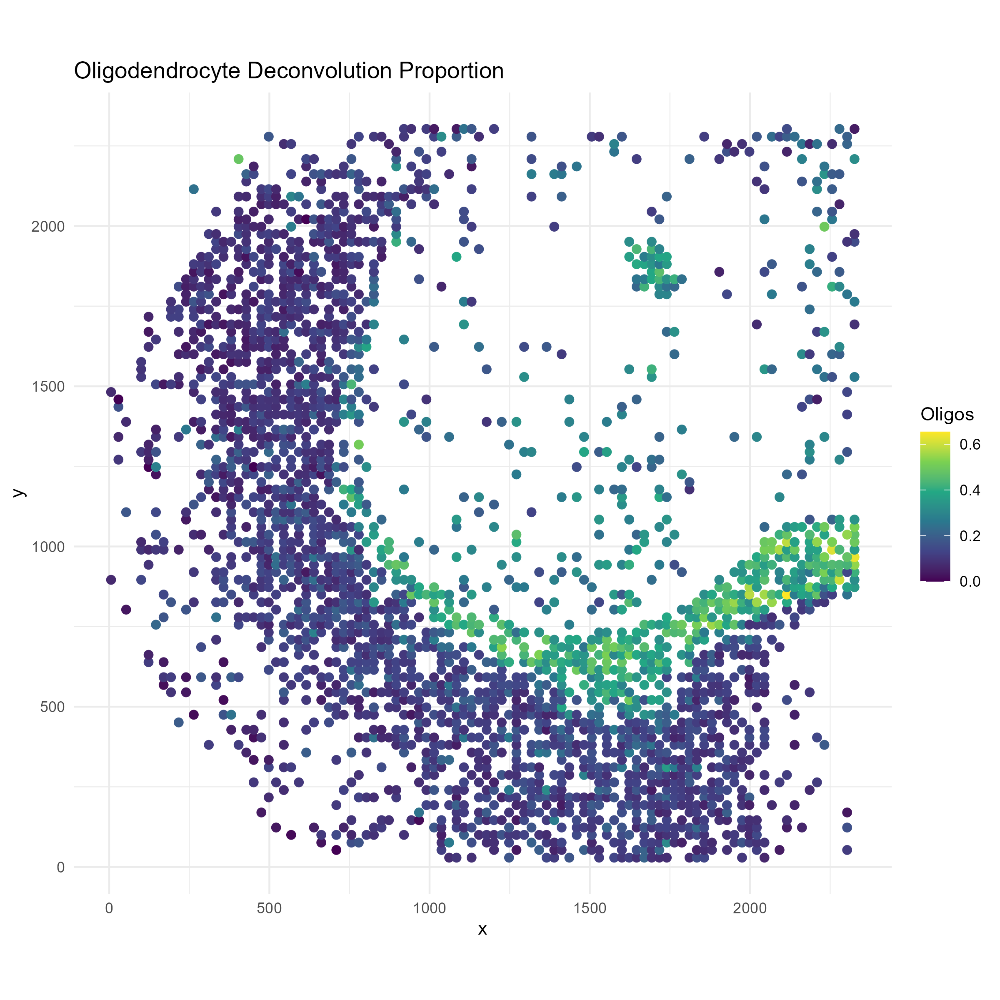

```{r, include = FALSE}
knitr::opts_chunk$set(
  collapse = TRUE,
  comment = "#>"
)
```


## Overview

In this vignette we will go through a typical analysis using spotGLM on a spatial ATAC dataset. The dataset comes from a [p22 mouse brain from this spatial epigenome-transcriptome co-profiling study by Di Zhang et al. 2023](https://www.nature.com/articles/s41586-023-05795-1#Fig1). In the dataset, there are 13 major cell types, among which we will focus on oligodendrocytes. The study also identified 14 distinct regions, among which we will focus on comparing between the cortex (C0) and the corpus callosum (C3).  We have called peaks and used ChromVAR to compute transcription factor activity scores by aggregating reads that overlap with their motif signatures. In this tutorial, our focus will be to identify changes in transcription factor motif accessibility across the two brain regions in a cell type specific manner. 


## Setup and data loading

We start by loading the following packages.
```
library(spotGLM)
library(ggplot2) # for plotting
library(scales) # for finetuning the appearance of ggplots 
library(dplyr) # for manipulating data tables
library(patchwork) # for qqplots side-by-side
library(ggrepel) # for labeling points in qqplot
```

The processed brain spatial ATAC data is stored in our public github repository.  We will read in the data with the `read_spatial_mouse_brain_atac_data()` function. The function returns the following

+ `coords`: Coordinate matrix. Of dimension 9215 by 2
+ `regions`: The one hot encoded region matrix for each spot. Of dimension 9215 by 14
+ `deconv`: The deconvolution of each spot. of dimension 9215 by 9
+ `motif_scores`: The motif score for each spot. A matrix of dimension 9215 by 746.

```
data = spotGLM::read_example_spatial_mouse_brain_atac_data()
```

## Plot of Spatial Regions

First, let's get a feel for this data by plotting a map of the spatial regions.

```
#number of regions
region = apply(data$regions,1,function(x){which(x == 1)})
n_regions <- length(unique(region))

# Create a data frame for plotting
plot_df <- data.frame(
  x = data$coords[, 1],
  y = data$coords[, 2],
  region = factor(region)  # convert to factor for discrete coloring
)

p1=ggplot(plot_df, aes(x = x, y = y, color = region)) +
  geom_point(size = 2) +
  scale_color_manual(values = hue_pal()(n_regions)) +
  labs(title = "Spots Colored by Region", color = "Region") +
  theme_minimal()

ggsave("brain_atac_region_map.png", plot=p1, width=8, height=8, dpi=300)

```


## Distribution of motif scores

Unlike the case of gene expression or isoform expression in the other tutorials, the distribution of motif scores are approximately normal, as we can see by randomly picking a few and visualizing their histograms:

```
png("brain_atac_motif_score_distributions.png", height=8, width=8, res=300, units="in")
par(mfrow=c(3,3))
for(i in sample(ncol(data$motif_scores), 9)){
  hist(data$motif_scores[,i], xlab="Motif Scores", main=colnames(data$motif_scores)[i], col="pink")
}
dev.off()
```



## Details on statistical model
Above, we found that the motif scores have approximately normally shaped distributions, so we will use a normal error model.  First suppose that we have single cell data. Let $Y_{i,m}$ be the motif score of cell $i$ for motif $m$. We would model $Y_{i,m}$ as follows
$$Y_{i,m} \sim \mathcal{N}(\beta^{CT(i)}_{m,r_i} + \beta^{CT(i)}_{m,0},\sigma_m^2).$$
Here $CT(i)$ represents the cell type of cell $i$ and $r_i$ represents the region that cell $i$ resides in. $\beta^{CT(i)}_{m,r_i}$ represents the expected motif score of a cell of type $CT(i)$ in region $r_i$, while $\beta^{CT(i)}_{m,0}$ is an intercept term. 

For spot-level data, let $Y_{s,m}$ be the score of motif $m$ in spot $s$.  We assume that this spot-level score is a weighted average of the motif scores for all cells that reside in it, i.e
$$Y_{s,m} \sim \mathcal{N}( \sum_{t}\pi_{s,t}(\beta^{t}_{m,r_s} + \beta^{t}_{m,0}),\sigma_m^2)$$
where the weight for cell type $t$,  $\pi_{s,t}$, is the deconvolution estimate of the contribution of cell type $t$ to spot $s$.  To test for differences in motif accessibility between regions in a cell type specific manner, we compute the p-value against the null hypothesis
$$H_0: \beta^{t}_{m,r} = \beta^{t}_{m,r'}.$$


## Fitting spotGLM model across all cell types and regions (~2 minutes)
Since we are using the normal noise model here, we are effectively fitting a linear model.  Thus, we can use the `spot_lm` function within spotGLM (`lm` standards for `linear model`).  The code below fits the model for each motif, effectively computing the $\beta$ parameters for each motif, each cell type, in each region.  The results are stored in `res`, which can be used downstream to test hypotheses of interest.  This is the time consuming part of the analysis, taking roughly 2 minutes.  


```
num_motifs = ncol(data$motif_scores)
res = vector("list",num_motifs)

t1 = Sys.time()
for(j in c(1:num_motifs)){
  if(j%%100 == 0){
    cat("Fitting model for motif ",j," out of ", num_motifs,"\n")
    print(Sys.time() - t1)
  }
  res[[j]] = spot_lm(y = data$motif_scores[,j],X = data$regions,
                     lambda = data$deconv)
}
names(res) = colnames(data$motif_scores)
```


## Oligodendrocyte Differential Motif Accessibility
We now focus on in oligodendrocytes in the corpus callosum vs cortex region and use the `compute_contrast_significance()` function to test the hypothesis, for each motif, whether its accessibility differs in oligodendrocytes between the two regions.  

```
sig_genes = compute_contrast_significance(input_list = res,
                                    cell_type = "Oligodendrocytes",
                                    effect_names = c("regionC3","regionC0"),
                                    beta_name = "beta_estimate",covariance_name = "vcov",
                                    sided = 1,direction = "pos")

sig_genes = sig_genes%>%filter(!is.na(pval))
```


### Visualize test significance via QQplot 
The code below draws a qq-plot of the motif test-statistics, labeling the top motifs.  We see that the Sox transcription factors rank at the top.

```
sig_genes_df <- sig_genes[order(sig_genes$test_statistic, decreasing = TRUE), ]
sig_genes_df$gene <- rownames(sig_genes_df)

qq <- qqnorm(sig_genes_df$test_statistic, plot.it = FALSE)
sig_genes_df$theoretical <- qq$x  # theoretical quantiles
sig_genes_df$sample <- qq$y       # sample quantiles
# Compute the slope and intercept for the QQ line
q1_sample <- quantile(sig_genes_df$test_statistic, 0.25, na.rm=TRUE)
q3_sample <- quantile(sig_genes_df$test_statistic, 0.75, na.rm=TRUE)
q1_theor  <- qnorm(0.25)
q3_theor  <- qnorm(0.75)
slope     <- (q3_sample - q1_sample) / (q3_theor - q1_theor)
intercept <- q1_sample - slope * q1_theor

# Select the top genes by highest t_test_stat
top_n <- 5
top_df <- sig_genes_df[order(sig_genes_df$test_statistic, decreasing = TRUE)[1:top_n], ]
# Create the QQ plot using ggplot2 with ggrepel for labeled boxes
p <- ggplot(sig_genes_df, aes(x = theoretical, y = sample)) +
  geom_point() +
  geom_abline(intercept = intercept, slope = slope, color = "red", size = 1) +
  geom_label_repel(data = top_df, aes(label = gene),
                   box.padding = 0.35, point.padding = 0.5, # size = 10, 
                   segment.color = "grey50", max.overlaps = 50) +
  labs(x = "Theoretical Quantiles", 
       y = "Sample Quantiles", 
       title = "Oligodendrocytes: Cortex vs Corpus Callosum") +
  theme_minimal() +
  theme(plot.title = element_text(face = "bold", hjust = 0.5))

ggsave("brain_atac_qqplot.png", plot=p, width=8, height=8, dpi=300)
```


## Example Motif: SOX4

We now focus on one example motif, Sox4, that shows differential motif accessibility in oligodendrocytes between the corpus callosum and the cortex. Let's visualize the distribution of this motif in space, and compare it to the distribution of oligodendrocytes.
```
motif <- "SOX4"
```

To make the visual contrast easier to see, we only plot the spots lying in regionC3 (Corpus Callosum) and regionC0 (Cortex):

```
region_filter <- data$regions[, "regionC3"] == 1 | data$regions[, "regionC0"] == 1
# Region labels
region_label <- ifelse(data$regions[region_filter, "regionC3"] == 1, "Corpus Callosum", "Cortex")
```

We need to truncate the motif scores so that outliers don't drive the color axis:
```
# Motif score with truncation
Sox_score <- data$motif_scores[region_filter, motif]
Sox_score <- pmin(Sox_score, quantile(Sox_score, 0.99, na.rm = TRUE))
Sox_score <- pmax(Sox_score, quantile(Sox_score, 0.01, na.rm = TRUE))
```

```
# Oligodendrocyte proportion
oligo_score <- data$deconv[region_filter, "Oligodendrocytes"]

# Create plotting data frame
plot_df <- data.frame(
  x = data$coords[region_filter, 1],
  y = data$coords[region_filter, 2],
  Sox = Sox_score,
  region = region_label,
  oligodendrocytes = oligo_score
)

# === Plot 1: SOX10 Motif Scores ===
p1 <- ggplot(plot_df, aes(x = x, y = y, color = Sox)) +
  geom_point(size = 2) +
  scale_color_viridis_c() +
  labs(title = paste0(motif, " Motif Scores"), color = motif) +
  coord_fixed() +
  theme_minimal()
ggsave("brain_atac_sox4_motif_map.png", plot=p1, width=8, height=8, dpi=300)

```


```
# === Plot 2: Region membership ===
p2 <- ggplot(plot_df, aes(x = x, y = y, color = region)) +
  geom_point(size = 2) +
  scale_color_manual(values = c("Cortex" = "#1f78b4", "Corpus Callosum" = "#33a02c")) +
  labs(title = "Region Membership", color = "Region") +
  coord_fixed() +
  theme_minimal()
ggsave("brain_atac_cortex_corpuscallosum_map.png", plot=p2, width=8, height=8, dpi=300)

```


```
# === Plot 3: Oligodendrocyte proportion ===
p3 <- ggplot(plot_df, aes(x = x, y = y, color = oligodendrocytes)) +
  geom_point(size = 2) +
  scale_color_viridis_c() +
  labs(title = "Oligodendrocyte Deconvolution Proportion", color = "Oligos") +
  coord_fixed() +
  theme_minimal()

ggsave("brain_atac_oligodendrocyte_map.png", plot=p3, width=8, height=8, dpi=300)

```


We see that oligodendrocytes are present at high concentrations in corpus callosum, but are also present throughout the cortex.  Through the spotGLM estimation, we are able to attribute the increase in Sox4 expression in the corpus callosum to the increased expression of this gene in the oligodendrocytes in the region.
