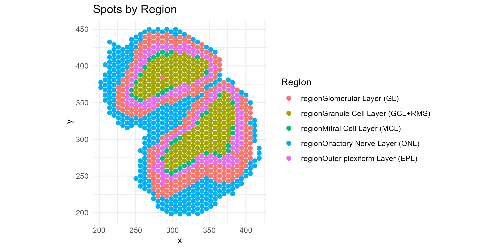
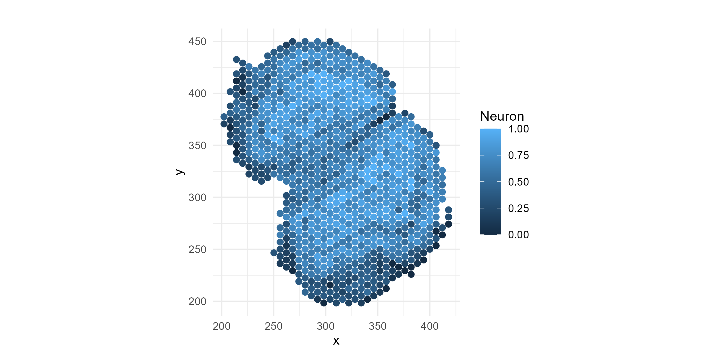
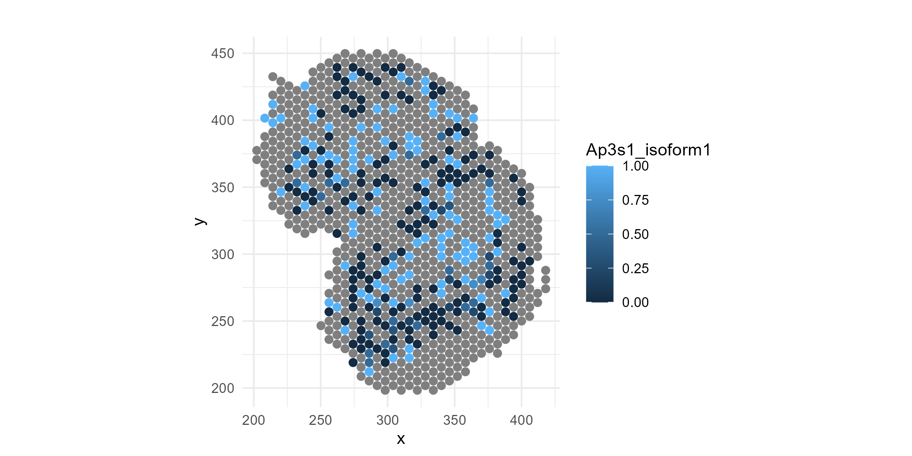
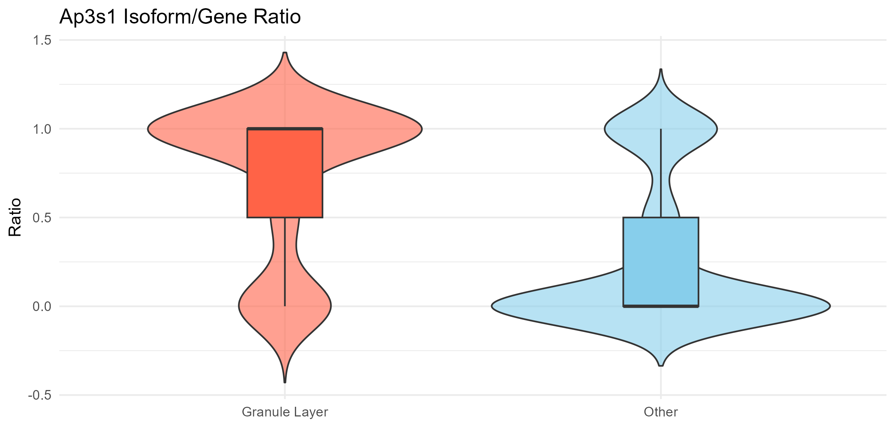
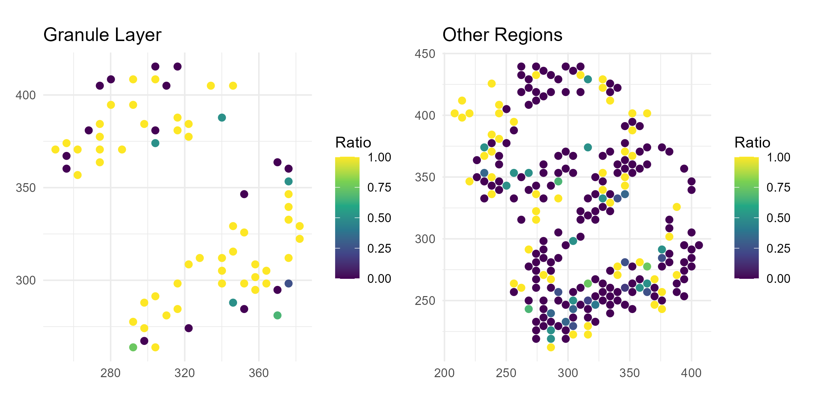

```{r, include = FALSE}
knitr::opts_chunk$set(
  collapse = TRUE,
  out.width = "100%",
  fig.align = "center",
  dev.args = list(pointsize = 6),  
  comment = "#>"
)
```

# Overview

This vignette demonstrates a full workflow using SpotGLM for cell type-specific spatial isoform analysis on a Visium Oxford Nanopore long read data set. This dataset comes from [this study of the mouse olfactory bulb](https://academic.oup.com/nar/article/51/8/e47/7079641). In this data set, there are 11 major cell types, spread across 5 distinct anatomical layers of the olfactory bulb. Our goal will be to identify genes that show evidence of isoform switching in a cell type specific manner across the spatial layers. 


## Read in the data

First, load the following packages needed for plotting and data table manipulation:
```
library(spotGLM)
library(ggplot2) # for plotting
library(dplyr) # for manipulating data tables
library(patchwork) # for qqplots side-by-side
```

Next, read in the olfactory bulb data with the `read_spatial_olfactory_bulb_long_read_data()` function. The function reads from the public repository where this data is stored, and returns a list with the following fields:

+ `coords`: Coordinate matrix. Of dimension 918 by 2
+ `niche`: The one hot encoded region matrix for each spot. Of dimension 918 by 5
+ `deconv`: The deconvolution of each spot. of dimension 918 by 11
+ `library size`: The library size of each spot. A vector of length 918
+ `total_gene_expression`: For each gene, a vector of spot gene expression. A matrix of dimension 918 by 643
+ `isoform expression`: A list with each element corresponding to a gene. `isoform expression[[gene]]` is a list of length two that contains the spot level expression of the top two isoforms for that gene. 

```
data = spotGLM::read_example_spatial_olfactory_bulb_long_read_data()
```

The deconvolved cell type proportions sometimes have cell types contributing very small amounts to a spot  We denoise by setting the proportions of these to 0.  

```
data$deconv[data$deconv < 0.05] = 0
data$deconv = t(apply(data$deconv,1,function(x){x/sum(x)}))
```

## Initial data visualization

First let's get a feel for this data by plotting spatial maps of the regions:

```
region = apply(data$regions,1,function(x){colnames(data$regions)[which(x == 1)]})

df <- data.frame(
  x = data$coords[, 1],
  y = data$coords[, 2],
  region = region
)

p1=ggplot(df, aes(x = x, y = y, color = region)) +
  geom_point(size = 2) +
  coord_fixed() +
  theme_minimal() +
  labs(title = "Spots by Region", color = "Region")

ggsave("olfactory_region_map.png", plot=p1, width=8, height=4, dpi=300)

```


Also, let's see how some of the cell types are distributed across the regions.  Let's try Neurons ("N"), the most common cell type.

```
df=cbind(df, data$deconv)
p1=ggplot(df, aes(x = x, y = y, color = N)) +
  geom_point(size = 2) +
  coord_fixed() +
  theme_minimal() +
  labs(title = "", color = "Neuron")

ggsave("olfactory_Neuron_spatial.png", plot=p1, width=8, height=4, dpi=300)

```



Now, let's plot the isoform proportions of a specific gene, Ap3s1, which we know (spoiler alert!) has spatially-variable isoform expression.  We will normalize the isoform-level expression by their total to get relative expression:

```
Ap3s1_isoform1=data$isoform_expression$Ap3s1[[1]]
Ap3s1_isoform2=data$isoform_expression$Ap3s1[[2]]
Ap3s1_isoform1 = Ap3s1_isoform1/(Ap3s1_isoform1+Ap3s1_isoform2)
Ap3s1_isoform2 = Ap3s1_isoform2/(Ap3s1_isoform1+Ap3s1_isoform2)
```

Plot the spatial map of the isoform relative expression:
```
df=cbind(df, Ap3s1_isoform1, Ap3s1_isoform2)
p1=ggplot(df, aes(x = x, y = y, color = Ap3s1_isoform1)) +
  geom_point(size = 2) +
  coord_fixed() +
  theme_minimal() +
  labs(title = "", color = "Ap3s1_isoform1")

ggsave("olfactory_Ap3s1_spatial_allregions.png", plot=p1, width=8, height=4, dpi=300)

```


If you look carefully, you can see that isoform-1 of the above gene seems to be depleted in the outer-most layer, the olfactory nerve layer.  The change is not obvious visually, is it significant?  Does this gene switch to isoform 2 in the outer-most layer?  If it does, such spatial patterns in isoform usage can simply be attributed to cell type composition changes, with no cell type-specific isoform switching, or to the switch in isoform usage within a cell type.  The goal of an spotGLM analysis is to assess the significance of such spatial variations and dissect what is happening at the cell type level.  

## Model Overview 
For simplicity, we are restricting our analysis to only those genes with exactly two isoforms whose summed expression comprise at least 20% of all isoforms expressed for that gene.  We further limit to genes with total expression across all spots greater than 50 UMIs. This is because for genes with low expression, we wouldn't have power to detect isoform switching, and they would inflate the number of tests we would have to adjust for in the end.  In total, 643 genes passed these two criteria. 

Next, for each gene, we identified the cell types where the gene has sufficient expression.  If a gene is not highly expressed in a given cell type, then it would be pointless to try to detect isoform switching in that cell type.   A gene $g$ is defined as being adequately expressed within a cell type $t$ if the total proportion of transcripts mapping to gene $g$ in cell type $t$ is greater than 1/60000. This proportion can be estimated by fitting a spotGLM for this gene, regressing total expression on the cell type proportions for each spot.  The model is as follows:
$$Y_{s,g} \sim Pois(\exp(\log(L_s) + \sum_{t} \pi_{s,t}\exp(\beta_{0,g}^t)))$$
In this model, $L_s$ is the library size of spot $s$,$\pi_{s,t}$ is the deconvolution estimate of cell type $t$ in spot $s$, and $\beta_{0,g}^t$ is the intercept estimate for cell type $t$. 


To identify cell type-specific isoform switching, we fit ths spotGLM model:
$$Y_{s,g} \sim Bin(n_{s,g},p_{s,g}),$$
where $Y_{s,g}$ is the count of isoform $1$ of gene $g$ in spot $s$, $n_{s,g}$ is the total expression of gene $g$ in spot $s$, and 
$$p_{s,g} = \sum_{t}w_{s,g,t}\text{Logit}^{-1}(X_s\beta_{t,g}), \quad w_{s,g,t}=\frac{\pi_{s,t}\mu_{g,t}}{\sum_{t'}\pi_{s,t'}\mu_{g,t'}}.$$
In the above formula, $\pi_{s,t}$ is the deconvolution proportion of cell type $t$ in spot $s$ and $\mu_{s,g,t}$ is the expected expression of gene $g$ in cell type $t$ in spot $s$ that is estimated in the above spotGLM regression of $Y_{s,g}$ on the cell type proportions.  

Thus, this analysis requires fitting spotGLM two times, once to get the estimated total expression of each gene originating from each cell type in each spot, and once more to get the isoform-specific expressions.  Below, we show how this estimation is done in code.

## Step 1: Estimate the cell type-specific total expression of each gene in each spot (~1 minute)
We first use `spotGLM::run_model`` for the cell type-specific estimation of total expression for each gene in each spot. The function is run separately for each gene, and thus can be parallelized across genes for large data sets.  In our function call, the response $y$ is set to the total count for a gene $g$ in each spot, and the covariates $X$ is just a vector of 1's (the intercept, since at this step we are not looking for differential expression across regions). $\lambda$ is the deconvolved cell type proportions in each spot. The offset is set to the library size of the each spot. The initialization is set to TRUE since we want to initialize all parameters. Our family is "spot poisson" since we are fitting a poisson model. 
```
#get number of genes 
ngenes = ncol(data$total_gene_expression)

#initialize estimates
intercept_estimate = vector("list",ngenes)
names(intercept_estimate) = colnames(data$total_gene_expression)
#iterate over each gene 
for(j in c(1:ngenes)){
  intercept_estimate[[j]]=spotGLM::run_model(y = data$total_gene_expression[,j],
                                             X = matrix(1,nrow(data$total_gene_expression),1),
                                             lambda = data$deconv,
                                             offset = log(data$library_size),
                                             initialization = T,
                                             family = "spot poisson",batch_size = 32, n_epoch = 500)
}
```


## Step 2: Fit SpotGLM model to get estimate isoform-specific coefficients for each cell type in each region (~1 minute)

Next, we fit the binomial spotGLM as described above. We again use the `run_model` function. This time, however, the family is "spot binomial" since we are running a binomial model. We additionally use two parameters that are specific to the binomial model: `weights` and `ct_cov_weights`. In a binomial regression, it is necessary to specify the total number of trials, which for our case corresponds to the total gene expression vector. Additionally, unlike the spot poisson model where the spot expression was a weighted mean of cell type level expression with the weight corresponding to $\pi_{s,t}$, in the spot binomial model, there is an additional cell type specific weight $\mu_{g,t} = \exp(\beta_{0,g}^t)$. This vector needs to be given to the `ct_cov_weights` argument. Thus, we fit the binomial model as follows:

```
isoform_DE = vector("list",ngenes)
names(isoform_DE) = colnames(data$total_gene_expression)
for(j in c(1:ngenes)){
  if(length(intercept_estimate[[j]])==0){
    next
  }
  #get gene name 
  gene = names(isoform_DE)[j]
  #get weights 
  weights = data$total_gene_expression[,gene]
  #get covariate weights 
  ct_covariate_weights  = exp(intercept_estimate[[gene]]$beta_estimate)
  #run model 
  isoform_DE[[j]] = spotGLM::run_model(y = data$isoform_expression[[gene]][[1]],
                                       X = data$regions,
                                       lambda = data$deconv,
                                       family = "spot binomial",
                                       weights = weights,
                                       ct_cov_weights = ct_covariate_weights,
                                       initialization = T,batch_size = 32, n_epoch = 500)
}
```

## Step 3: Contrast regions for a given cell type to detect spatial isoform switching (<1 minute)
We now test for cell type specific isoform switching across regions. This uses the `compute_contrast_significance()` function, for which you need to input a specific cell type and the regions you want to compare.  Here, we simply loop over all cell types and all region-pairs.  We store all results into a data frame `combined_contrast_tests` which can be viewed or filtered to get all significant genes for a specific region-pairs of interest.

```
cell_types = colnames(data$deconv)
regions = colnames(data$regions)
nregion = length(regions)
counter = 1
all_contrast_tests = list()  # list to store results 
# loop over all cell types and region pairs 
for(ct in cell_types){
  for(j in c(1:nregion)){
    for(k in c(j:nregion)){
      if(j==k){
        next
      }
      region_A = regions[j]
      region_B = regions[k]
      #compute pvalues
      pvals = suppressWarnings(spotGLM::compute_contrast_significance(input_list = isoform_DE,
                                           cell_type = ct,
                                           effect_names = c(region_A,region_B),
                                           beta_name = "beta_estimate",
                                           covariance_name = "vcov",
                                           sided = 2))
      
      contrast_tests = data.frame(gene = pvals$name, cell_type = ct, 
                                  region_A = region_A, region_B = region_B, 
                                  pval = pvals$pval)
      #add results to list 
      all_contrast_tests[[counter]] = contrast_tests
      counter = counter + 1
    }
  }
}
combined_contrast_tests <- dplyr::bind_rows(all_contrast_tests)%>%
                                                    dplyr::filter(!is.na(pval))
```
Compute false discovery q-value using Benjamini-Hochberg:
```
combined_contrast_tests$qval = p.adjust(combined_contrast_tests$pval,method = "BH")
```
Use 10\% false discovery rate as a threshold, get significant cell type-specific isoform switching events between regions:
```
significant_isoform_switches = combined_contrast_tests%>%filter(qval < 0.1)
```


### Example Gene: Ap3s1

Here we show the gene we showed above, Ap3s1, which has significant isoform switching between the granule layer and other layers in Neurons (q-value < 0.05 in the table above).  Thus, let's compare the relative expression of isoform 1 for this gene between the granule layer and the other layers. 

```
gene <- "Ap3s1"

# Isoform ratio
isoform_vals <- data$isoform_expression[[gene]][[1]]
gene_total <- data$total_gene_expression[, gene]
ratio <- isoform_vals / gene_total
ratio[!is.finite(ratio)] <- NA

# Region labels
region <- apply(data$regions, 1, function(x) {
  colnames(data$regions)[which(x == 1)]
})

# Binary group
region_group <- ifelse(region == "regionGranule Cell Layer (GCL+RMS)", "Granule Layer", "Other")

# Combined dataframe
df <- data.frame(
  x = data$coords[,1],
  y = data$coords[,2],
  ratio = ratio,
  region = region_group
) %>% filter(!is.na(ratio))

# === Plot 1: Violin + boxplot ===
p1 <- ggplot(df, aes(x = region, y = ratio, fill = region)) +
  geom_violin(trim = FALSE, alpha = 0.6) +
  geom_boxplot(width = 0.2, outlier.shape = NA) +
  theme_minimal() +
  labs(
    title = paste(gene, "Isoform/Gene Ratio"),
    x = "", y = "Ratio"
  ) +
  scale_fill_manual(values = c("Granule Layer" = "tomato", "Other" = "skyblue")) +
  theme(legend.position = "none")

ggsave("olfactory_Ap3s1_violin.png", plot=p1, width=8, height=4, dpi=300)

```


Now, let's plot the relative isoform 1 expression for this gene separately for the Granule Layer and the other layers:
```
# === Plot 2: Spatial plot - Granule Layer only ===
p2 <- df %>%
  filter(region == "Granule Layer") %>%
  ggplot(aes(x = x, y = y, color = ratio)) +
  geom_point(size = 2) +
  scale_color_viridis_c(na.value = "grey90") +
  coord_fixed() +
  theme_minimal() +
  labs(title = "Granule Layer", x = NULL, y = NULL, color = "Ratio")

# === Plot 3: Spatial plot - Other regions ===
p3 <- df %>%
  filter(region == "Other") %>%
  ggplot(aes(x = x, y = y, color = ratio)) +
  geom_point(size = 2) +
  scale_color_viridis_c(na.value = "grey90") +
  coord_fixed() +
  theme_minimal() +
  labs(title = "Other Regions", x = NULL, y = NULL, color = "Ratio")
ggsave("olfactory_Ap3s1_spatial.png", plot=p2+p3, width=8, height=4, dpi=300)
```



