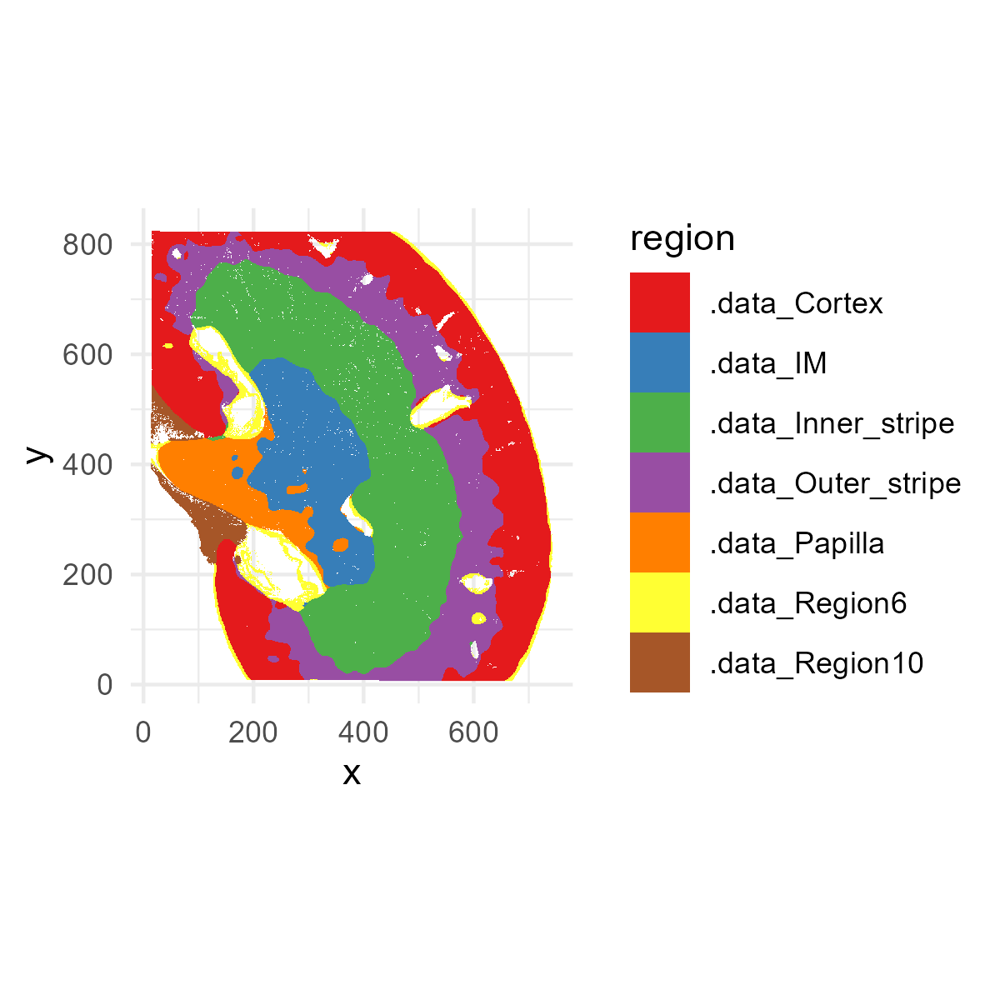
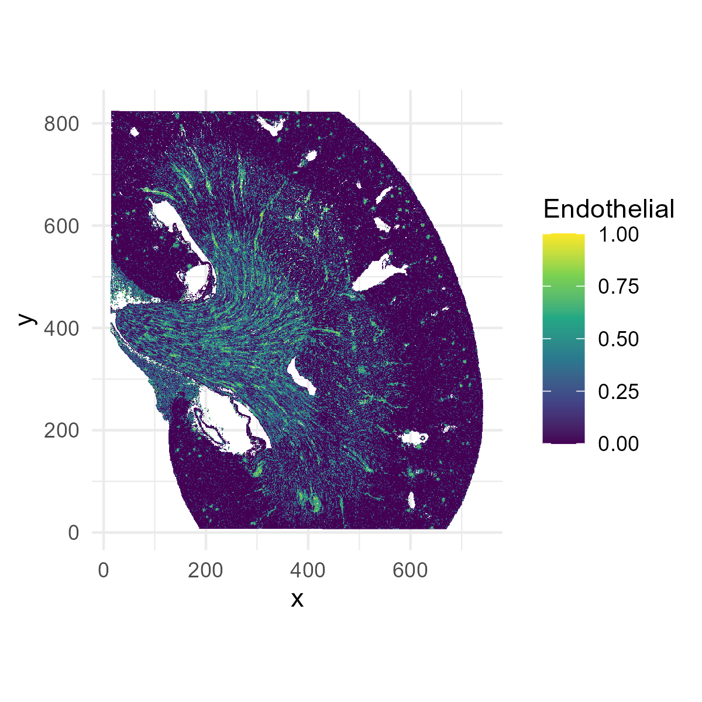
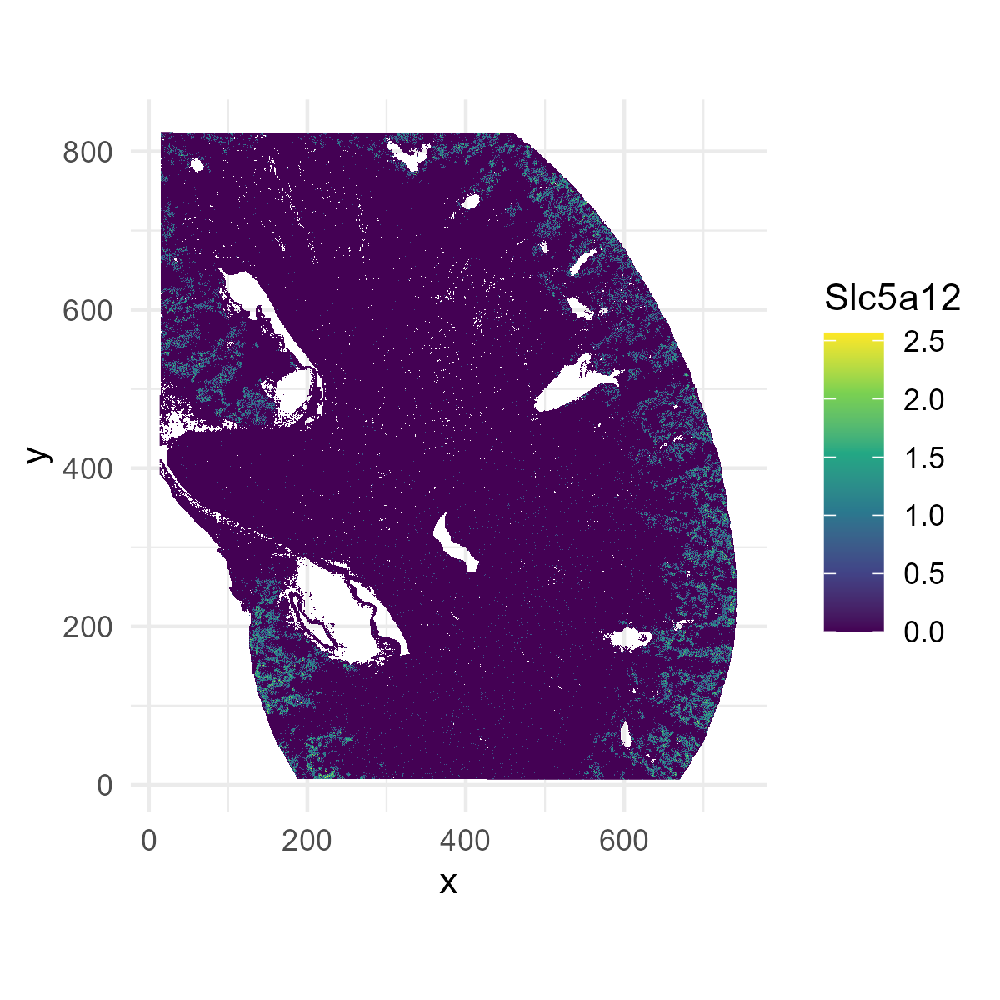
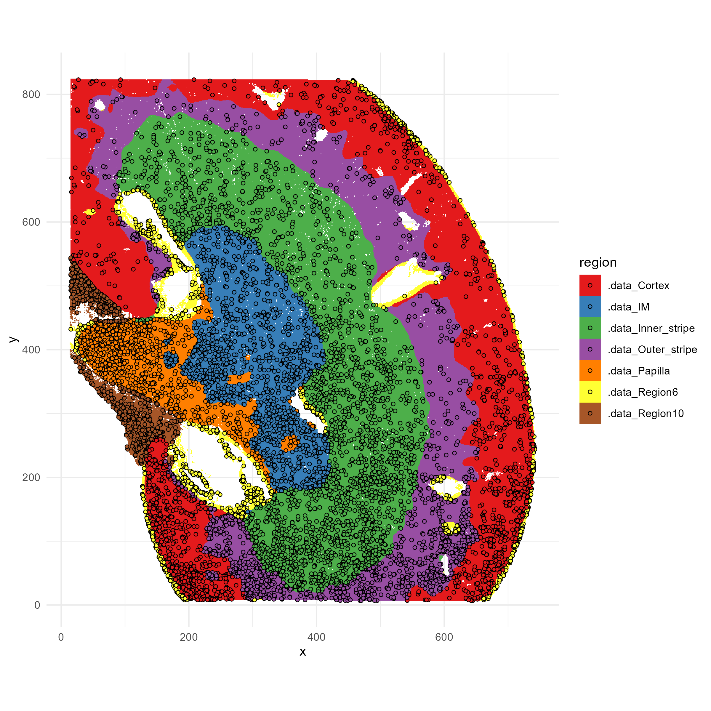
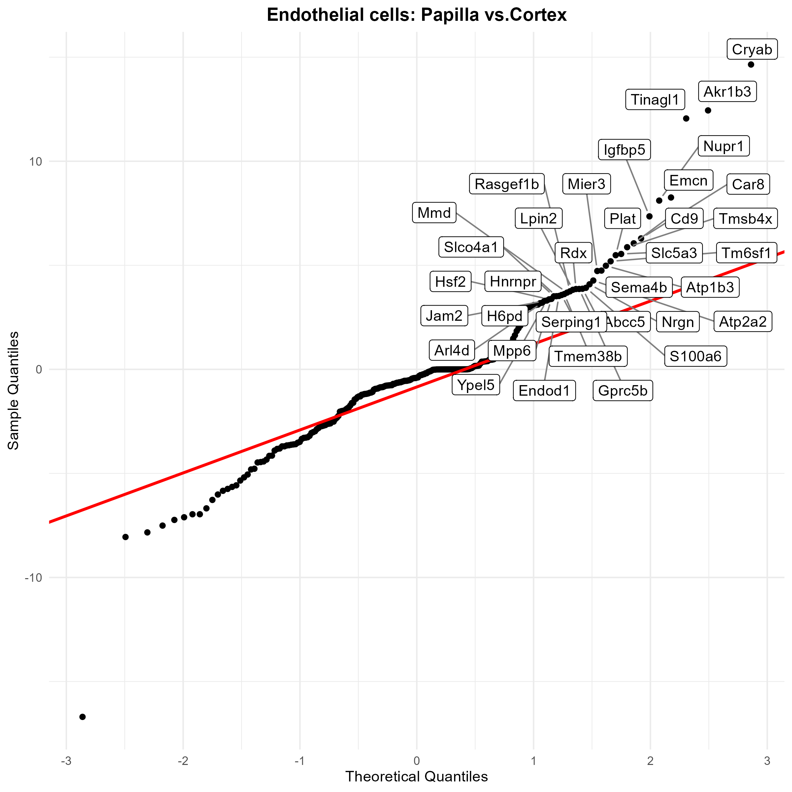
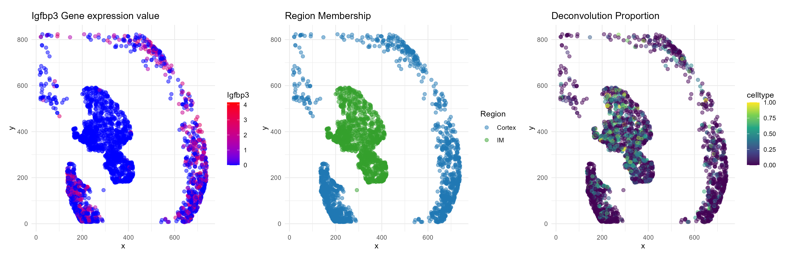

```{r, include = FALSE}
knitr::opts_chunk$set(
  collapse = TRUE,
  comment = "#>"
)
```

## Overview
This vignette demonstrates a full analysis workflow using SpotGLM for cell type-specific niche differential expression analysis on a Visium HD data set.  We will also demonstrate how [SPARROW](https://kaishumason.github.io/SPARROW/) can be used for power-preserving data selection, to speed up the analysis.  

We will use this [publicly available Visium HD mouse kidney dataset](https://www.10xgenomics.com/datasets/visium-hd-cytassist-gene-expression-libraries-of-mouse-kidney), which can be downloaded form 10X Genomics. 

All runtimes reported are on a Windows 11 (64-bit) machine with 64GB ram and Intel(R) Core(TM) Ultra 7 165U 1700 Mhz processor with 12 cores.  The total runtime for this script is <30 minutes.  The parts of the script where runtime is not reported should finish instantaneously.

## Setup and preparing data matrices

First, load some required packages. 

```
library(spotGLM)
library(ggplot2) # for plots
library(patchwork) # for plots
library(ggrepel) # for labeling points in qqplot
library(dplyr) # for fast manipulation of gene tables
library(tidyverse)
```
SpotGLM requires three input matrices" 


+ **Spot-by-gene counts matrix**:  This is the raw count matrix directly output by by 10X
+ **Spot-by-cell type compositions matrix**: This is the spot deconvolution result, giving the contribution of each cell type to each spot.  We will use [RCTD](https://www.nature.com/articles/s41587-021-00830-w) as an example, but you can use any other method.  Deconvolution can take *a few hours*, so we provide this matrix, and you can skip this step for now.   
+ **Spot-by-niche covariate matrix**: This contains the spatial niche covariates for the right-hand-side of the spotGLM regression.  For this analysis, we will use kidney anatomical regions defined via clustering of histological image features extracted from the same-slide H&E image. This feature extraction and clustering takes *a few hours with GPU*, so we provide this matrix for you to use.  You can define spatial niches/domains/neighborhoods using other methods as well.  


<<<<<<< HEAD
If you would like to try these pre-processing steps yourself, you can use the script we provide below.  Otherwise, skip directly to the next section.
=======
We need to input files for spotGLM: celltype deconvolution matrix, and spatial niche matrix. All data required for deconvolution and spatial niches can be found here: https://www.dropbox.com/scl/fo/qi0ij5n2sdo7zz68tajfa/AEe4nXVqldBGK1KBmh7nU8c?rlkey=208dfsao16jvq45uvj0evazpz&dl=0 
>>>>>>> 8e131e327d7d47f8becc4edaf93c0addf4ad28d7


<<<<<<< HEAD
<details>  <summary>**Pre-processing script for preparing the data matrices.** </summary>
We load some libraries used specifically by RCTD.
```
library(arrow)
library(spacexr) 
```
We will also load Seurat, which is used to read in the Visium files and extract the counts and spatial coordinates.
```
library(Seurat)
```

As described in our paper, we bin the Visium HD data into 8 micron squares.  This alleviates the extreme sparsity in the data.  You can download the binned data from **here**, as well as the cell type reference file for deconvolution using RCTD.  Simply download the zip file, extract all files into a folder named "mouse_kidney_data_input", and put this foler into the root directory where you are doing the analysis.  

=======
>>>>>>> 8e131e327d7d47f8becc4edaf93c0addf4ad28d7
```
localdir <- "mouse_kidney_data_input/data/binned_outputs/square_008um"
output_dir <- "mouse_kidney_data_input/preprocessed_data/"
dir.create(output_dir, showWarnings = F)
```
Read in the data, and run RCTD.  This will take a while. 
```
reference <- readRDS( "mouse_kidney_data_input/RCTD_reference_data/Mouse_kidney_RCTD_reference.rds")
counts<-Read10X_h5(file.path(localdir, "filtered_feature_bc_matrix.h5"))
coords<-read_parquet(file.path(localdir, "spatial/tissue_positions.parquet"), as_data_frame = TRUE)
coords <- as.data.frame(coords)
rownames(coords)<-coords$barcode
coords <- coords[coords$barcode %in% colnames(counts),]
coords<-coords[,3:4]
nUMI <- colSums(counts)
puck <- SpatialRNA(coords, counts, nUMI)
barcodes <- colnames(puck@counts)
myRCTD <- create.RCTD(puck, reference, max_cores = 12)
myRCTD <- run.RCTD(myRCTD, doublet_mode = 'doublet')
saveRDS(myRCTD,file=file.path(output_dir,"Deconvolution_HD.rds"))
```
Now, take the RCTD output, and make the spot composition matrix for input into spotGLM:

```
cell_types = unique(reference@cell_types)
cell_types = droplevels(cell_types)
types = unique(cell_types)
coords <-  myRCTD@spatialRNA@coords
deconv_est = matrix(0,nrow(coords),length(types))
colnames(deconv_est) = types
rownames(deconv_est) = rownames(myRCTD@spatialRNA@coords)
for(j in c(1:nrow(myRCTD@results$results_df))){
  fills = match(unlist(myRCTD@results$results_df[j,c("first_type", "second_type")]), types)
  deconv_est[j,fills] = myRCTD@results$weights_doublet[j,]
}
deconv_df <- as.data.frame(deconv_est)
saveRDS(deconv_df , file.path(output_dir, "deconv_matrix.rds"))
```

Write a matrix containing the spatial coordinates:
```
coords_all<-read_parquet(file.path(localdir, "spatial/tissue_positions.parquet"),as_data_frame = TRUE)
coords_all <- as.data.frame(coords_all)
rownames(coords_all)<-coords_all$barcode
coord_df <- coords_all[coords_all$barcode %in% rownames(deconv_df),]
coord_df <- coord_df[rownames(deconv_df),]
coord_df <- coord_df %>% select(-barcode)
head(coord_df)
saveRDS(coord_df , file.path(output_dir, "coords.rds"))
```

Write a matrix containing the counts:
```
data <- Load10X_Spatial(data.dir = localdir)
count <- data@assays$Spatial$counts
count <- count[, rownames(deconv_df)]
saveRDS(count, file.path(output_dir, "count_matrix.rds"))
```
<<<<<<< HEAD
=======

- Spatial niches are defined using kidney anatomical regions. We identified spatial domains and manually annotated kidney anatomical regions from histological image features using iSTAR (Zhang, D. et al.). This file is directly provided for spotGLM analysis. Each spot is assigned with a dummy variable of kidney anatomical region.

```
regions_df <- read.csv(file.path("mouse_kidney_data_input/data/kidney_region_annotation/istar_output/nclusters10-hist/", "spots_he_cluster.csv"), row.names = 1)
regions_df = regions_df[regions_df$he_clusters_region != "Region0",]
regions <- regions_df$he_clusters_region
names(regions) <- rownames(regions_df)
EN = as.matrix(dummy_cols(regions)[, -c(1)])
saveRDS(EN, "EN_covariate_matrix.rds")
```


# Load Data

We first load the data and prepare for spotGLM.

<details>
  <summary>Input</summary>
  
+ `deconv`: The deconvolution of each spot. Of dimension number of spots by cell types
+ `EN`: The spatial niche vector (in this case, mouse kidney regions) for each spot. Of dimension number of spots by kidney regions
+ `coords`: Coordinate matrix. Of dimension number of spots by 2
+ `counts`: The counts matrix for spot-by-gene matrix
>>>>>>> 8e131e327d7d47f8becc4edaf93c0addf4ad28d7
</details>


## Load data matrices and initial data clean

We first load the data and prepare for spotGLM, defining the following variables:
  
+ `deconv`: The deconvolution of each spot, of dimension number of spots by cell types
+ `EN`: The spatial niche vector (in this case, mouse kidney regions) for each spot, of dimension number of spots by kidney regions
+ `coords`: Coordinate matrix, of dimension number of spots by 2
+ `counts`: The counts matrix for spot-by-gene matrix, of dimension number of spots by number of genes


```
data_dir <- "mouse_kidney_data_input/preprocessed_data/"
deconv = readRDS(file.path(data_dir,"deconv_matrix.rds"))
EN = readRDS(file.path(data_dir,"EN_covariate_matrix.rds"))
coords = readRDS(file.path(data_dir, "coords.rds"))[,2:5]
counts = t(readRDS(file.path(data_dir,"count_matrix.rds")))
```

For this data, some of the spots didn't have anatomical annotation.  Thus, we keep only those spots that are in the `EN` environment covariate matrix.  

```
coords = coords[rownames(EN), ]
counts = counts[rownames(EN), ]
deconv = deconv[rownames(EN), ]
```
To get a sense of what you are working with, you can now visualize this data.  First, let's plot the spatial niches (the `EN` spatial covariate matrix).
```
# Convert one-hot matrix to factor of region names
region_vector <- factor(colnames(EN)[max.col(EN, ties.method = "first")],levels = colnames(EN))

# Create plotting data frame
plot_df <- data.frame(
  x = coords[, 2],
  y = coords[, 1],
  region = region_vector,
  Endothelial = deconv[,"Endothelial cells"]
)

p1=ggplot(plot_df, aes(x=x,y=y,fill=region))+
  geom_raster()+
  scale_fill_brewer(palette="Set1")+
  coord_fixed()+
  theme_minimal()

ggsave("kidney_niches.png", plot=p1, width=4, height=4, dpi=300)
```



Next, let's plot the distribution of endothelial cells (the Endothelial cell column of the `deconv` matrix).  Later, we will be finding endothelial cell-specific niche markers.
```
p1=ggplot(plot_df[,], aes(x = x, y = y, fill = Endothelial)) +
  geom_raster() +
  scale_fill_viridis_c() +
  coord_fixed() +
  theme_minimal() 

ggsave("kidney_endothelial.png", plot=p1, width=4, height=4, dpi=300)
```



Next, let's try plotting a gene, Slc5a12:
``` 
plot_df$Slc5a12 = log(1+counts[,"Slc5a12"])
p1=ggplot(plot_df[,], aes(x = x, y = y, fill = Slc5a12)) +
  geom_raster() +
  scale_fill_viridis_c() +
  coord_fixed() +
  theme_minimal() 
ggsave("kidney_Slc5a12.png", plot=p1, width=4, height=4, dpi=300)
```



The deconvolved cell type proportions sometimes have cell types contributing very small amounts to a spot  We denoise by setting the proportions of these to 0.  

```
deconv[deconv < 0.1] = 0
deconv = t(apply(deconv,1,function(x){x/sum(x)}))
<<<<<<< HEAD
=======

# Get spot library sizes
spot_size = rowSums(counts)

# Get niche-DE covariates
CT_weights = rep(1,ncol(deconv))
deconv_weighted = t(apply(deconv,1,function(x){x*CT_weights}))
deconv_weighted = t(apply(deconv,1,function(x){x/sum(x)}))
original_CT = colnames(deconv)

selected_genelist <- readRDS( "test_genes/genelist.rds")
counts = counts[, genelist]

data = list()
data$niche <- EN
data$deconv <- deconv_weighted
data$counts <- counts
>>>>>>> 8e131e327d7d47f8becc4edaf93c0addf4ad28d7
```

SpotGLM is a gene-specific analysis and can be parallelized across genes. For this tutorial, we show spotGLM on a small list of genes, so that the analysis can be completed in a few minutes.  We also provide the parallelization script so that you can run it on the full transcriptome.  

We always recommend filtering out lowly expressed genes, as such genes increase the number of tests you will need to adjust for, and reduces the power for other genes.  Filtering them out also avoids unnecessary computation.  

```
genelist <- readRDS(file.path(data_dir,"genelist.rds")) 
counts = counts[, genelist]
```

Finally, put the gene counts, cell type proportions, and niche environment all into one `list` object for passing to our functions.

```
data = list(niche=EN, deconv=deconv, counts=counts, coords=coords)
```
Next, we use SPARROW to reduce the data to a smaller size while preserving power for this analysis.  This is optional, and you can skip to the next section if you want to simply run on the full data set.  

## Use SPARROW for power-preserving data reduction

[SPARROW](https://kaishumason.github.io/SPARROW/) is a method that selects a small representative sub-sample from a large dataset to reduce computation time. The sub-sample is chosen to maximize the power of a downstream analysis, which, in this case, is SpotGLM with the given spatial covariates and cell type decomposition.  SPARROW computes the number of spots needed for high power, and chooses the spots to get balanced representation across cell type-niche configurations.  

Here, as demonstration, we will use sparrow to select 10,000 spots with 18 cell types and 7 spatial niches. For a full data analysis, you should let SPARROW automatically select the number of spots based on power calculations.  The compute time of this part of the script takes about 2 minutes, but if you were to remove the 10,000 spot restriction, it will take about 20 minutes.  However, this gene selection step can cut the run-time of the spotGLM analysis from 1 week to overnight, with minimal loss of power.  


First, create the expanded covariate matrix, as described in our paper.
```
cutoff = -6.5
expanded_X = sparrow::expand_covariate_matrix(X = data$niche, lambda = data$deconv,
                                              family = "negative binomial",lib_size = rowSums(data$counts),min_reads_per_1000 = 1000*exp(cutoff))

```

You can take a look at the columns of expanded_X, to get a sense of what this matrix holds.  It gives the weight of each spot in every possible (cell type $\times$ spatial niche) combination.

Next, remove the covariates with too many zero entries, and compute the target standard error.  The target standard error is the standard error needed to achieve a power of `target_power_approx` (here set to `99\%`) on effects of size `min_effect` (here set to 0.05).  These target standard errors will be used in the next step to determine how much data reduction we can tolerate, and which spots we should select, to guarantee the desired power.
```
freq <- apply(expanded_X, 2, function(x) sum(x > 0) )
bad_cov <- which(freq < 30)
expanded_X <- expanded_X[, -bad_cov]
target_standard_errors = sparrow::compute_target_standard_error(X = expanded_X,min_effect = 0.05,target_power_approx = 0.99)
```

The `data_selection` function in Sparrow selects the spots based on the expanded covariate matrix and the target standard errors.  Here, we set a maximum of 10,000 spots.  In a full data analysis, we recommend increasing this maximum to 100,000 spots.

```
selected_indices = sparrow::data_selection(X = t(expanded_X),
                                           max_data_size = 10000,
                                           min_standard_error = target_standard_errors,
                                           log = TRUE,period = 5000)
selected_indices = selected_indices[!is.na(selected_indices)]
print(paste0("#Cells Subsampled: ", length(selected_indices)))
```
You can visualize which indices were selected, overlayed on the spatial map of the anatomical niches:
```
p1=ggplot(plot_df, aes(x=x,y=y,fill=region))+
  geom_raster()+
  scale_fill_brewer(palette="Set1")+
  coord_fixed()+
  theme_minimal()
# overlay with selected indices
overlay_df <- plot_df[selected_indices, ]
p1=p1 + geom_point(data = overlay_df, aes(x = x, y = y),
             color = "black", shape = 21, size = 1.2, stroke = 0.4)

ggsave("kidney_selected_indices.png", plot=p1, width=8, height=8, dpi=300)
```


We see that the selected spots are distributed across the anatomic regions, and all regions are represented.  However, the spots are not uniformly distributed but are more dense in some regions; that is because those regions have higher complexity in cell types or cell type-niche combinations.   If we were to explore the deconvolved cell types proportions within each niche, we would find that every cell type-niche combination is also evenly represented.  This allows us to retain the desired power in differential tests involving all of these cell types and spatial niches.     

Now, we can subset the data to the selected indices for downstream analysis
```
data$deconv = data$deconv[selected_indices,]
data$counts = data$counts[selected_indices,]
data$coords = data$coords[selected_indices,]
data$niche = data$niche[selected_indices,]
data$library_size = rowSums(data$counts)
```

## Fit SpotGLM model and identify cell type-specific niche markers 
We are now ready to run spotGLM on the selected data.  This proceeds in two steps.  First, we fit a spotglm model (using `spotGLM::run_model`) on each gene to estimate its cell type-specific coefficients for each spatial covariate.  This is the most time-consuming step of the analysis, which *should be parallelized across genes*.  After fitting the model, you can then test all sorts of hypotheses with it, such as contrasting two spatial niches to identify cell type-specific niche markers.   


<details>
  <summary> Expand to see the model that we are fitting. </summary>

Let $X$ be the the covariate matrix where the $s$-th row is the vector describing the spatial domain of spot $s$.  In this example, the $s$-th row has dimension 7, for 7 anatomic domains, and is the one-hot encoding of the spot's anatomic domain.    We model the expression of a gene in spot $s$ as Poisson, with mean that is dependent on the spatial covariates: 

$$Y_{s,g} \sim Pois(\mathbb{E}[Y_{s,g}|X_{s}])$$
The mean expression is equal to the sum of contributions across cell types that belong to the spot,

$$\mathbb{E}[Y_{s,g}|X_{i}] = \log(L_s) + \sum_{t} \pi_{s,t}\exp(X_s\beta^{t}_g) $$
Here $L_s$ is the library size of spot $s$ and $\pi_{s,t}$ is the deconvolution estimate for cell type $t$ in spot $s$.  The contribution of each cell type depends on the spatial covariates $X_s$ through the parameter vector $\beta_g^t$.  This vector has dimension equal to the number of columns in $X$.  During model fitting, we are estimating $\beta_g^t$ for each gene $g$ and each cell type $t$.  Downstream, the estimates and standard errors of $\beta_g^t$ will be used for cell type-specific niche-differential expression analysis.  
</details>


### Testing on a reduced set of genes

In this tutorial, we first test the model for ~230 genes. This process takes ~15 minutes. 

```
t1=Sys.time()
num_genes = ncol(data$counts)
spotglm_fit = vector("list",num_genes)
for(j in c(1:num_genes)){
  if(j%%5 == 0){
    print(paste("fitting model for gene", j, "out of",num_genes))
    print(Sys.time() - t1)
  }
  spotglm_fit[[j]] = spotGLM::run_model(y = data$counts[,j], X = data$niche, lambda = data$deconv,
                             family = "spot negative binomial", offset = log(data$library_size),
                             batch_size = 250, learning_rate = 0.1)
}
print("done!")
names(spotglm_fit) = colnames(data$counts)
```

To run spotGLM on all genes, we recommend using parallel computing library `parallel`.  Please expand to get the script for doing this.

<details>
  <summary> spotGLM with parallelization across all genes </summary>
  
```
library(parallel)
library(foreach)
family <- "spot negative binomial"
G = 0.1
data_size = 8 * prod(dim(counts))/1e+09
#number of chunks needed
nchunks = ceiling(data_size/G)
chunk_size = ceiling(ncol(counts)/nchunks)
grouping <- rep(1:nchunks, each = chunk_size, length.out = ncol(counts))
index_chunks = split(1:ncol(counts), grouping)
chunk_counter = 1
T_1 = Sys.time()
for (I in c(1:length(index_chunks))) {
  t1 = Sys.time()
  print("Initializing cluster")
  cluster <- parallel::makeCluster(5, outfile = "")
  doParallel::registerDoParallel(cluster)
  clusterExport(cluster, varlist = c("spot_negative_binomial"))
  print(paste0("Evaluating chunk ", I, " out of ",
               nchunks))
  counts_chunk = as.matrix(counts[, index_chunks[[I]]])
  NC = ncol(counts_chunk)
  results_chunk = foreach::foreach(i = 1:NC, .export = c("X", "lambda", "family","offset",
                                                         "counts_chunk")) %dopar% {
                                                           if(i%%1 == 1){
                                                             print(i)
                                                             print(Sys.time())
                                                           }
                                                           
                                                           print(Sys.time())
                                                           Y = counts_chunk[, i]
                                                           spotglm::run_model(Y, X = X, lambda = lambda,family = family, offset = offset,learning_rate = 0.1, batch_size = 128,n_epoch = 250)
                                                         }
  if (chunk_counter == 1) {
    spotglm_fit = results_chunk
  }
  else {
    spotglm_fit = c(spotglm_fit, results_chunk)
  }
  rm(counts_chunk)
  gc()
  chunk_counter = chunk_counter + 1
  print("Closing cluster")
  parallel::stopCluster(cluster)
  print(paste0("Chunk took ",Sys.time() - t1))
}
names(spotglm_fit) = colnames(counts)
T_2 = Sys.time()

print(T_1)
print(T_2)
```

</details>

Now that you have fit the spotglm model on each gene, you can identify cell type-specific gene markers for spatial niches.  

## Identifying cell type-specific niche marker genes
To identify niche marker genes, we perform a *contrast test*, contrasting the cell type-specific niche coefficients for each gene, between spatial niches of interest.  We can do this using the `compute_contrast_significance()` function.  We need to tell this function which spatial covariates (i.e. niches) we are contrasting.  

<details>
A niche marker gene for a cell type $t$ is one in which 
$$\beta^{t}_{n_1,g} \neq \beta^{t}_{n_2,g}$$
that is that we can differentiate whether cell type $t$ is near a niche enriched by niche1 $n_1$ or niche $n_2$ by looking at its gene expression for gene $g$.
</details>

For example, let's find the niche marker genes for differentiating Endothelial cells in the Papilla region vs those in the Cortex region. For papilla region markers, we want genes that are upregulated in the papilla region.  Thus, we specify that we want a one-sided test in the positive direction (side = 1, direction = "pos").

```
cell_type = "Endothelial cells"
niche1 = ".data_Papilla" 
niche2 = ".data_Cortex"
sig_genes = compute_contrast_significance(input_list = spotglm_fit,
                                          cell_type = cell_type,
                                          effect_names = c(niche1, niche2),
                                          beta_name = "beta_estimate",covariance_name = "vcov",
                                          sided = 1,direction = "pos")
sig_genes = sig_genes%>%dplyr::filter(!is.na(pval))

```

## Data Visualization

### QQplot 
First, we use a QQ plot to get a sense of what the p-value distribution look like, and highlight the significant genes.

```
sig_genes_df <- sig_genes[order(sig_genes$test_statistic, decreasing = TRUE), ]
sig_genes_df$gene <- rownames(sig_genes_df)

qq <- qqnorm(sig_genes_df$test_statistic, plot.it = FALSE)
sig_genes_df$theoretical <- qq$x  # theoretical quantiles
sig_genes_df$sample <- qq$y       # sample quantiles
# Compute the slope and intercept for the QQ line
q1_sample <- quantile(sig_genes_df$test_statistic, 0.25, na.rm=TRUE)
q3_sample <- quantile(sig_genes_df$test_statistic, 0.75, na.rm=TRUE)
q1_theor  <- qnorm(0.25)
q3_theor  <- qnorm(0.75)
slope     <- (q3_sample - q1_sample) / (q3_theor - q1_theor)
intercept <- q1_sample - slope * q1_theor

# Select the top genes by highest t_test_stat
top_n <- 35
top_df <- sig_genes_df[order(sig_genes_df$test_statistic, decreasing = TRUE)[1:top_n], ]
# Create the QQ plot using ggplot2 with ggrepel for labeled boxes
p <- ggplot(sig_genes_df, aes(x = theoretical, y = sample)) +
  geom_point() +
  geom_abline(intercept = intercept, slope = slope, color = "red", size = 1) +
  geom_label_repel(data = top_df, aes(label = gene),
                   box.padding = 0.35, point.padding = 0.5, # size = 10, 
                   segment.color = "grey50", max.overlaps = 50) +
  labs(x = "Theoretical Quantiles", 
       y = "Sample Quantiles", 
       title = paste0(cell_type, ": ", str_replace(niche1, ".data_", ""), " vs.", str_replace(niche2, ".data_", ""))) +
  theme_minimal() +
  theme(plot.title = element_text(face = "bold", hjust = 0.5))

ggsave("kidney_qqplot.png", plot=p, width=8, height=8, dpi=300)

```




### Spatial map of example gene: Igfbp3
We can also visualize the spatial distribution of a specific gene.  First, we normalized the counts:
$$ \hbox{normalized count} = \log\left(1+10000\times \frac{\hbox{count}}{\hbox{library-size}}\right)$$
We didn't have to do this until now, because the SPARROW and SpotGLM package internally accounts for library size in their computations.  For plotting, we need to use the normalized values.

```
<<<<<<< HEAD
counts_data <- data$counts
total_counts <- colSums(counts_data)
=======
gene <- "Igfbp3"

data_sparrow = list()
data_sparrow$niche <- EN
data_sparrow$deconv <- deconv_weighted
data_sparrow$counts <- counts
data_sparrow$coords <- coords[, c(3:4)]

region_filter <- data_sparrow$niche[, ".data_Cortex"] == 1 | data_sparrow$niche[, ".data_IM"] == 1

counts <- data_sparrow$counts
total_counts <- colSums(counts)
>>>>>>> 8e131e327d7d47f8becc4edaf93c0addf4ad28d7
scale_factor <- 1e4
scaled_counts <- t(t(counts) / total_counts) * scale_factor
normalized_counts <- log1p(scaled_counts)
<<<<<<< HEAD
data$normcounts <- normalized_counts
```

Let's look at a marker that we just identified for distinguishing  between endothelial cells in the Papilla region versus those in the Cortex region. 
```
gene <- "Igfbp3"

# Filter for spots only in the two regions being compared
region_filter <- data$niche[, ".data_Cortex"] == 1 | data$niche[, ".data_IM"] == 1
gene_expr <- data$normcounts[region_filter, gene]
cellprop_score <- data$deconv[region_filter, "Endothelial cells" ]
region_label <- ifelse(data$niche[region_filter, ".data_Cortex"] == 1, "Cortex", "IM")
=======
data_sparrow$normcounts <- normalized_counts

# gene expression 
gene_expr <- data_sparrow$normcounts[region_filter, gene]
cellprop_score <- data_sparrow$deconv[region_filter, "Endothelial cells" ]
region_label <- ifelse(data_sparrow$niche[region_filter, ".data_Cortex"] == 1, "Cortex", "IM")
>>>>>>> 8e131e327d7d47f8becc4edaf93c0addf4ad28d7

# Create plotting data frame
plot_df <- data.frame(
  x = data_sparrow$coords[region_filter, 2],
  y = data_sparrow$coords[region_filter, 1],
  Gene = gene_expr,
  region = region_label,
  celltype = cellprop_score
)

# === Plot 1: Gene expression levels ===
p1 <- ggplot(plot_df, aes(x = x, y = y, color = Gene)) +
  geom_point(size = 2, alpha=0.5) +
  scale_color_viridis_c() +
  labs(title = paste0(gene, " Gene expression value"), color = gene) +
  coord_fixed() +
  theme_minimal() + 
  scale_color_gradient(low = "blue", high = "red") 

# === Plot 2: Region annotation ===
p2 <- ggplot(plot_df, aes(x = x, y = y, color = region)) +
  geom_point(size = 2, alpha=0.5) +
  scale_color_manual(values = c("Cortex" = "#1f78b4", "IM" = "#33a02c")) +
  labs(title = "Region Membership", color = "Region") +
  coord_fixed() +
  theme_minimal()

# === Plot 3: Endoehelial cell type proportion ===
p3 <- ggplot(plot_df, aes(x = x, y = y, color = celltype)) +
  geom_point(size = 2, alpha=0.5) +
  scale_color_viridis_c() +
  labs(title = "Deconvolution Proportion") +
  coord_fixed() +
  theme_minimal()  


combined_plot = p1+p2+p3
ggsave("example_gene.png", plot=combined_plot, width=15, height=5, dpi=300)

```


We see that while endothelial cells are present in both the cortex and IM, the endothelial gene `Igfbp3` has visible expression enrichment only in the cortex.      
