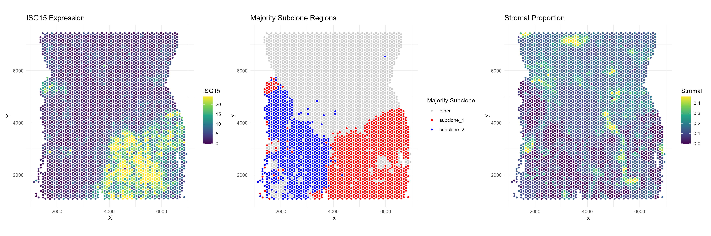

```{r, include = FALSE}
knitr::opts_chunk$set(
  collapse = TRUE,
  comment = "#>"
)
```

# Overview
This vignette demonstrates a full analysis workflow using SpotGLM for cell type-specific niche differential expression analysis on a Visium data set.  The dataset comes from a colorectal cancer patient, [initially published in this study](https://aacrjournals.org/cancerdiscovery/article/12/1/134/675646/Spatiotemporal-Immune-Landscape-of-Colorectal). We have already identified 3 normal cell types: hepatocytes, myeloid cells, and stromal cells, as well as two subclones of the tumor found via [Clonalscope](https://www.biorxiv.org/content/10.1101/2022.07.05.498882v2). For each spot, we summarize its cellular niche by computing a weighted sum of cell type concentrations of the spots surrounding it, with closer spots weighted higher. We will then use spotGLM to identify genes that display significant niche associations in a cell type specific way. 


## Setup and data loading 

First, load the following packages needed for plotting and data table manipulation:
```
library(spotGLM)
library(ggplot2) # for plotting
library(dplyr) # for manipulating data tables
library(patchwork) # for qqplots side-by-side
```

Next, read in the colorectal cancer data with the `read_example_visium_colorectal_cancer_data()` function. The function reads from the public repository where this data is stored, and returns a list with the following fields:

+ `coords`: Coordinate matrix. Of dimension 3826 by 2
+ `niche`: The niche vector for each spot. Of dimension 3826 by 7
+ `deconv`: The deconvolution of each spot. of dimension 3826 by 7
+ `counts`: The counts matrix for 2000 genes. Of dimension 3826 by 2000
+ `library size`: The library size of each spot. A vector of length 3826

```
data = spotGLM::read_example_visium_colorectal_cancer_data()
```

## Plotting the data
As mentioned, each spot's spatial niche is encoded by a vector of length $T$ where $T$ is the number of cell types in the sample. This vector becomes the covariate in our spotGLM model.  The larger this value for a given cell type, the higher the concentration of that cell type in the neighborhood of the spot. For example, to get a feel for this data, let's plot the niche covariate term for tumor subclone 1, and contrast it with the tumor cell concentration in each spot:  

```
# Prepare data for plotting
plot_df_deconv <- data.frame(
  x = data$coords[, 1],
  y = data$coords[, 2],
  subclone_1 = data$deconv[, "subclone_1"]
)

plot_df_niche <- data.frame(
  x = data$coords[, 1],
  y = data$coords[, 2],
  subclone_1 = data$niche[, "subclone_1"]
)

# Plot 1: deconv
p1 <- ggplot(plot_df_deconv, aes(x = x, y = y, color = subclone_1)) +
  geom_point(size = 1) +
  scale_color_viridis_c() +
  labs(title = "Deconvolution - Subclone 1", color = "Subclone 1") +
  theme_minimal()

# Plot 2: niche
p2 <- ggplot(plot_df_niche, aes(x = x, y = y, color = subclone_1)) +
  geom_point(size = 1) +
  scale_color_viridis_c() +
  labs(title = "Niche Covariate - Subclone 1", color = "Subclone 1") +
  theme_minimal()

```
Display side by side:

```
ggsave("colorectal_tumor_subclone_side-by-side.png", plot=p1+p2, width=12, height=6, dpi=300)
```


we see that the tumor subclone 1 niche covariate is high in regions where the tumor deconvolution is also high. 


## SpotGLM model details
We describe here the SpotGLM model that we will use for this data.  This model is also described in our paper.  Let $X$ be the the covariate matrix where the $i$th row of X, $X_i$ corresponds to the $T$ dimensional effective niche vector described above. The single cell glm model for each cell type is 
$$Y_{i,g} \sim Pois(\mathbb{E}[Y_{i,g}|X_{i}])$$
$$\log(\mathbb{E}[Y_{i,g}|X_{i}]) = X_i\beta^{CT(i)}_g + \log(L_i)$$
Here $L_i$ is the library size of cell $i$, $CT(i)$ is the cell type assignment of cell $i$ and $\beta^{CT(i)}_g$ is a vector of dimension $T \times 1$ that acts as a weight vector for cells of type $CT(i)$ for gene $g$. If an index of $\beta^{CT(i)}_g$, $\beta^{CT(i)}_{t',g}$ is not equal to 0, then the amount of cell $t'$ in the niche affects the expression of gene $g$ in cells of type $CT(i)$. This is called a (CT(i),t') niche differential gene. \

For a spot $s$, its gene expression is modeled as the sum of the cells that make up the sot and thus can be modeled as 

$$Y_{s,g} \sim Pois(\mathbb{E}[Y_{s,g}|X_{s}])$$
$$\mathbb{E}[Y_{s,g}|X_{i}] = \log(L_s) + \sum_{t} \pi_{s,t}\exp(X_s\beta^{t}_g) $$
Here $L_s$ is the library size of spot $s$ and $\pi_{s,t}$ is the deconvolution estimate for cell type $t$ in spot $s$. This model can be fit using a spotGLM. to do this we use the "run model" function. This function takes several arguments, the most important of which are below.

## Fitting the SpotGLM model (~ 10 minutes)

To detect cell type-specific niche-associated genes, we run SpotGLM in two steps.    First, we use the `run_model()` function to estimate the $\beta_g^t$ parameters for all genes, which capture the cell type-specific niche associations.  Then, we use the `compute_significance` function to identify the significant associations. Running `run_model()` is the time consuming step, and will take 20 minutes on the 2000 genes that we have after filtering.  However, this step can be parallelized across genes.  We first show how to do this without parallelization, on a small set of genes:

```
num_genes = ncol(data$counts)
res = vector("list",num_genes) # container for the results
t1 = Sys.time()
for(j in c(1:num_genes)){
  if(j%%100 == 0){
    cat("Fitting model for gene ",j," out of ", num_genes,"\n")
    print(Sys.time() - t1)
  }
  res[[j]] = spotGLM::run_model(y = data$counts[,j],X = data$niche, lambda = data$deconv,family = "spot poisson",offset = log(data$library_size),initialization = T,batch_size = 250)
}
names(res) = colnames(data$counts)

```


<details>  <summary>**Expand for the code to perform the above on all genes with parallelization.** </summary>

</details> 

## Identifying significant niche differential genes 
After fitting the spotGLM model, we can evaluate which genes are niche-associated. For index cell type `i` (say, fibroblasts) and niche cell type `n` (say, tumor), a gene is `(i,n)` associated if its expression in cell type `i` is associated with the concentration of cell type `n` in its spatial niche.  To identify such genes, we use the function `compute_significance`, with parameter `cell_type` set to the index cell type, and parameter `effect_name` set to the niche cell type.  

For example, let's focus on genes whose expression in fibroblasts depend on the concentration of tumor subclone-1 in its niche.  We set `side=1` and `direction="pos"`, so that we get those genes that are *upregulated* in fibroblasts when tumor subclone-1 is present.

```
sig_genes = compute_significance(input_list = res,cell_type = "stromal",
                                 effect_name = "subclone_1",
                                 beta_name = "beta_estimate",
                                 standard_error_name = "standard_error_matrix",
                                 sided = 1,direction = "pos")
sig_genes = sig_genes%>%filter(!is.na(pval))
print("The following genes are (fibroblast,tumor subclone 1) niche differential")
print(rownames(sig_genes)[sig_genes$qval < 0.05])
```

## Contrasting two niches for a cell type

We can also perform a contrast test to see if a gene is niche-marker gene. A niche marker gene for a cell type $t$ is one in which 
$$\beta^{t}_{t_1,g} \neq \beta^{t}_{t_2,g}.$$
If this test rejects, that means we can differentiate whether cell type $t$ resides in a niche enriched by cell type $t_1$ or cell type $t_2$ by looking at its gene expression for gene $g$. We can also do this using the `compute_contrast_significance()` function, giving it the cell type of interest (`cell_type`) and the effects to contrast(`effect_names`).  

For example, let's find niche marker genes in fibroblasts that can distinguish between tumor subclone-1 vs tumor subclone-2. We set side = 1 and direction = "pos" so that the genes with small p-value correspond to those that are upregulated in fibroblasts when in the presence of tumor subclone-1.

```
#compute contrast test
sig_genes = compute_contrast_significance(input_list = res,
                                    cell_type = "stromal",
                                    effect_names = c("subclone_1","subclone_2"),
                               beta_name = "beta_estimate",covariance_name = "vcov",
                               sided = 1,direction = "pos")
sig_genes = sig_genes%>%filter(!is.na(pval))
m = paste0("The following genes are niche marker genes for fibroblasts near",
            " tumor sublcone 1 vs tumor subclone 2")
print(m)
print(rownames(sig_genes)[sig_genes$qval < 0.05])
```


## Visualization of significant genes

### Example: ISG15

Note that ISG15 is both a (fibroblast,subclone-1) niche differential gene as well as a niche marker gene for differentiating subclone-1 versus subclone-2. If we plot the expression of ISG15 we see this visually.  

First, threshold the outliers so that they don't drive the color axes in the plots.

```
gene <- "ISG15"

# Expression clipping
expression <- data$counts[, gene]
expression <- pmax(expression, quantile(expression, 0.05))
expression <- pmin(expression, quantile(expression, 0.95))

#deconvolution clipping
deconv_prop = data$deconv[, "stromal"]
deconv_prop = pmax(deconv_prop , quantile(deconv_prop , 0.01))
deconv_prop = pmin(deconv_prop , quantile(deconv_prop , 0.99))
```

```
# === Plot 1: ISG15 Expression ===
df1 <- data.frame(
  x = data$coords[, 1],
  y = data$coords[, 2],
  gene = expression
)

p1 <- ggplot(df1, aes(x = x, y = y, color = gene)) +
  geom_point(size = 1) +
  scale_color_viridis_c() +
  coord_fixed() +
  theme_minimal() +
  labs(
    title = paste0(gene, " Expression"),
    x = "X", y = "Y", color = gene
  )

# === Plot 2: Majority subclones ===
majority_subclone <- colnames(data$deconv)[max.col(data$deconv,
                                                   ties.method = "first")]
df2 <- data.frame(
  x = data$coords[, 1],
  y = data$coords[, 2],
  majority = majority_subclone
)

df2$highlight <- case_when(
  df2$majority == "subclone_1" ~ "subclone_1",
  df2$majority == "subclone_2" ~ "subclone_2",
  TRUE ~ "other"
)

p2 <- ggplot(df2, aes(x = x, y = y, color = highlight)) +
  geom_point(size = 1) +
  scale_color_manual(
    values = c(
      "subclone_1" = "red",
      "subclone_2" = "blue",
      "other" = "grey80"
    )
  ) +
  coord_fixed() +
  theme_minimal() +
  labs(title = "Majority Subclone Regions", color = "Majority Subclone")

# === Plot 3: Stromal proportions ===
df3 <- data.frame(
  x = data$coords[, 1],
  y = data$coords[, 2],
  stromal = deconv_prop
)

p3 <- ggplot(df3, aes(x = x, y = y, color = stromal)) +
  geom_point(size = 1) +
  scale_color_viridis_c() +
  coord_fixed() +
  theme_minimal() +
  labs(title = "Stromal Proportion", color = "Stromal")

# === Combine all plots ===
ggsave("colorectal_tumor_subclone_ISG15.png", plot=p1+p2+p3, width=18, height=6, dpi=300)
```



The fibroblasts in tumor subclone 2 region express much less ISG15 than those in the subclone 1 region.   Additionally, the non tumor region ("other) shows very little expression of ISG15.

### Example: COL4A1

Next, consider COL4A1, which is a (fibroblast,subclone-1) niche differential gene but not significant when we contrast subclone-1 versus subclone-2. If we plot the expression of COL4A1 we can also see this visually. 

```
gene <- "COL4A1"

# Expression clipping
expression <- data$counts[, gene]
expression <- pmax(expression, quantile(expression, 0.05))
expression <- pmin(expression, quantile(expression, 0.95))

#deconvolution clipping
deconv_prop = data$deconv[, "stromal"]
deconv_prop = pmax(deconv_prop , quantile(deconv_prop , 0.01))
deconv_prop = pmin(deconv_prop , quantile(deconv_prop , 0.99))

# === Plot 1: ISG15 Expression ===
df1 <- data.frame(
  x = data$coords[, 1],
  y = data$coords[, 2],
  gene = expression
)

p1 <- ggplot(df1, aes(x = x, y = y, color = gene)) +
  geom_point(size = 1) +
  scale_color_viridis_c() +
  coord_fixed() +
  theme_minimal() +
  labs(
    title = paste0(gene, " Expression"),
    x = "X", y = "Y", color = gene
  )

# === Plot 2: Majority subclones ===
majority_subclone <- colnames(data$deconv)[max.col(data$deconv,
                                                   ties.method = "first")]

df2 <- data.frame(
  x = data$coords[, 1],
  y = data$coords[, 2],
  majority = majority_subclone
)

df2$highlight <- case_when(
  df2$majority == "subclone_1" ~ "subclone_1",
  df2$majority == "subclone_2" ~ "subclone_2",
  TRUE ~ "other"
)

p2 <- ggplot(df2, aes(x = x, y = y, color = highlight)) +
  geom_point(size = 1) +
  scale_color_manual(
    values = c(
      "subclone_1" = "red",
      "subclone_2" = "blue",
      "other" = "grey80"
    )
  ) +
  coord_fixed() +
  theme_minimal() +
  labs(title = "Majority Subclone Regions", color = "Majority Subclone")

# === Plot 3: Stromal proportions ===
df3 <- data.frame(
  x = data$coords[, 1],
  y = data$coords[, 2],
  stromal = deconv_prop
)

p3 <- ggplot(df3, aes(x = x, y = y, color = stromal)) +
  geom_point(size = 1) +
  scale_color_viridis_c() +
  coord_fixed() +
  theme_minimal() +
  labs(title = "Stromal Proportion", color = "Stromal")

# === Combine all plots ===
ggsave("colorectal_tumor_subclone_COL4A1.png", plot=p1+p2+p3, width=18, height=6, dpi=300)
```


